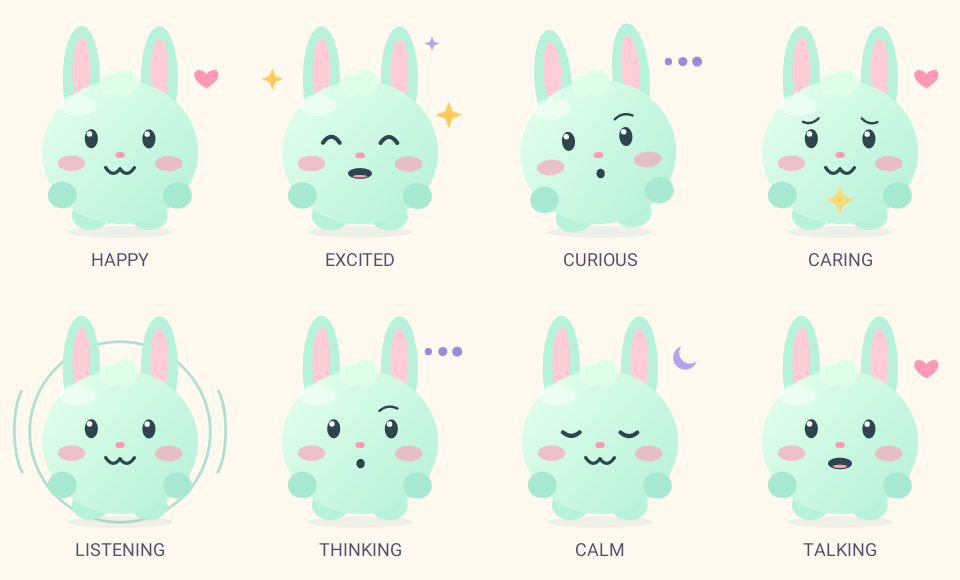

# Momo Companion

Momo Companion is a small-screen Xiaozhi Android client for the Kiumo ZH23-YL-RF watch, with a pettable, dressable mint bunny and a dedicated hold-to-talk button.

Version: **0.4.4-momo-companion** (version code 20). Package: `com.kiumo.xiaozhi`.



## Features

- Android 8.1 compatible: minimum API 26, target/compile API 34.
- Lightweight native vector avatar: blinking, gentle movement, celebrations, an animated talking mouth and surprise Peekaboo/silly faces, waves or dances while idle. Adaptive animation pacing reduces work between interactions.
- Happy, excited, curious, caring, calm, listening, thinking, and sleepy expressions.
- Server emotion messages plus local conversation-text cues; no extra AI service for avatar mood.
- Touch Momo's ears, head, nose, hands, belly or feet for funny gestures; accurate body-shaped hit areas prevent background touches. Swipe to pet a body part or long-press for cuddles with floating hearts.
- Seven outfits (including pajamas and superhero cape) and seven accessory choices (including none), saved locally with a live preview.
- Four offline games: **Momo Says** (shuffled), **Tickle Race**, **Dance Party**, and **Hug Time** (three long-press cuddles). Game steps and a progress bar stay visible during reactions, a one-tap Stop button is available, and stars from wins are saved on the watch.
- Dedicated on-screen **Talk** button (hold to record, release to send); tapping Momo never starts voice recording.
- Physical-button push-to-talk with learn/mapping mode remains supported.
- Microphone opens only while PTT is held and stops on release, cancellation, pause, focus loss, or connection loss.
- Self-hosted WebSocket with automatic device-token setup and binding-code display.
- Idle surprise gestures pause while speaking, listening, playing, in dialogs, in the background or when reduced motion is enabled.
- Both ARM architectures, compressed native libraries, and code/resource shrinking for a small APK.

See [Pet, Play, and Dress Up](docs/PLAY_AND_DRESS.md) for watch touch controls and games.

## Build

Use JDK 17. Install the following Android SDK components in Android Studio's SDK Manager:

- Android SDK Platform 34
- Android SDK Build-Tools 34.0.0
- NDK 25.1.8937393
- CMake 3.22.1

The project includes the Gradle 8.2 wrapper and uses Android Gradle Plugin 8.2.2 and Kotlin 1.9.22. Opus 1.5.2 source is bundled under `app/src/main/cpp/opus`; no submodule checkout is required. Other dependencies are downloaded on the first build.

Open this folder in Android Studio and select JDK 17 for Gradle. Let Android Studio create `local.properties` for your SDK location. Alternatively set `ANDROID_HOME` to your SDK directory and run:

Windows:

```powershell
.\gradlew.bat assembleRelease lintRelease testReleaseUnitTest
```

macOS / Linux:

```sh
chmod +x gradlew
./gradlew assembleRelease lintRelease testReleaseUnitTest
```

APK: `app/build/outputs/apk/release/app-release.apk`.

Without additional configuration, release and debug APKs use the local Android debug key. Different GitHub-hosted runners often generate different debug keys, so preview APKs may **not** install over an existing APK with the same package name. Save any settings/pairing details before a necessary uninstall.

### Persistent signing for updates (optional, recommended)

For repeatable in-place upgrades on the watch, securely generate and **back up one permanent private keystore**, then add these four GitHub repository **Actions secrets** (Settings → Secrets and variables → Actions):

- `MOMO_WATCH_SIGNING_KEYSTORE_BASE64`: Base64-encoded keystore file; encode the binary file as one continuous line (on Linux, `base64 -w0 your-watch.jks`; on Windows PowerShell, `[Convert]::ToBase64String([IO.File]::ReadAllBytes("C:\path\to\watch.jks"))`).
- `MOMO_WATCH_SIGNING_STORE_PASSWORD`: Keystore password.
- `MOMO_WATCH_SIGNING_KEY_ALIAS`: Alias selected when generating the key.
- `MOMO_WATCH_SIGNING_KEY_PASSWORD`: Private-key password.

GitHub Actions restores these secrets **only for trusted pushes to `main` or manually initiated `workflow_dispatch` runs**, never for pull requests or ordinary feature-branch pushes. If all four are configured, the build signs its debug APK with the persistent certificate; otherwise it uses the default debug signer. Partial configuration causes the trusted job to fail rather than silently produce an APK signed with a different key. Private keys are never committed or included in the APK artifact.

Locally, set environment variables `MOMO_WATCH_KEYSTORE_PATH`, `MOMO_WATCH_KEYSTORE_PASSWORD`, `MOMO_WATCH_KEY_ALIAS` and `MOMO_WATCH_KEY_PASSWORD` to use the same signer.

**Important:** A newly configured persistent key still cannot update an *older APK already signed with a different key*. Preserve the original keystore if you have one. A one-time uninstall/re-pair may be required when migrating. Keep the permanent signing key backed up securely; losing it prevents future in-place updates.

## Connect

The defaults are:

```text
WebSocket: wss://xiaozhi.spacecloud.space/xiaozhi/v1/
Device setup / OTA: https://xiaozhi.spacecloud.space/xiaozhi/ota/
```

These are public endpoint addresses, not credentials. Change them in the app's Settings for your own server. Leave Bearer token blank and enable **Get token from my server** for automatic authentication. If a binding code appears, bind it in your server console and reconnect. Device and client identity are generated on the watch; no real watch ID or bearer token is included in this source archive.

The app keeps the configured WebSocket address even if the OTA response advertises a placeholder or private address. OTA setup does not download or install firmware. Normal operation does not require xiaozhi.me.

Spoken responses use your server's model, voice, and role. See [Momo's role prompt](docs/Momo-Kids-Personality.md) for a playful, encouraging personality. Expressions are approximate text/server cues, and mouth movement is an animation rather than phoneme-level lip synchronization.

## Branding and upgrade compatibility

The launcher name, Settings title, bunny icon, and Gradle project use Momo Companion branding. The internal package ID `com.kiumo.xiaozhi`, JNI namespaces, preference names, and device identity are retained so the signed APK can update the existing watch installation. A suggested GitHub repository name is `momo-companion`.

## Upload to GitHub

Extract this archive and upload the **contents of this folder**, including `.gitignore`, to a new repository. Do not upload the ZIP as your only repository file. Retain `LICENSE` and `THIRD_PARTY_NOTICES.md`.

For Git users, from this folder:

```sh
git init
git add .
git commit -m "Initial Momo Companion source"
git branch -M main
```

Then follow your new GitHub repository's instructions to add its remote and push. `build/`, `.cxx/`, SDK paths, APKs, logs, and signing keys are ignored. Android Studio build output is not needed in the repository.

## Verification and credits

The earlier Momo APK passed build/signature verification and tests. Version 0.4.4 adds Hug Time for long-press interactions and adaptive animation pacing (~11fps idle, ~25fps while active) for a more efficient, responsive watch avatar. Run watch CI and test on physical hardware. Physical watch testing remains necessary.

Adapted from [jerrygugu/xiaozhi-android](https://github.com/jerrygugu/xiaozhi-android), commit `e2a026401247f8313262d8fc1e7400dd53fb8e4d`, under the MIT license. Bundled [Opus 1.5.2](https://github.com/xiph/opus/tree/v1.5.2), commit `ddbe48383984d56acd9e1ab6a090c54ca6b735a6`, retains its BSD license and notices. Momo artwork and watch adaptations were added for this build. See [third-party notices](THIRD_PARTY_NOTICES.md).
